# AST251: Life on Other Worlds — Midterm Study Hub

> 🎯 **Goal**: Top-percentile performance through deep understanding and pattern recognition

---

## 📚 Study Materials

| Resource | Purpose | When to Use |
|----------|---------|-------------|
| [[Knowledge-Map.canvas]] | Visual topic dependencies | Start here to see the big picture |
| [[Topic-Deep-Dives]] | Detailed concept explanations | Deep learning sessions |
| [[Study-Guide]] | Active recall checkpoints | Self-testing and progress tracking |
| [[Quick-Reference]] | Formulas, constants, tables | Quick review and exam prep |
| [[Midterm-Practice-Questions]] | Exam-level questions | Test readiness, pattern recognition |

---

## 🗺️ Course Map (Weeks 1-4)

```mermaid
graph TD
    A[Week 1: SETI & Fermi Paradox] --> B[Week 2: Chemistry of Life]
    B --> C[Week 3: Stellar Astrophysics]
    C --> D[Week 4: Planetary Habitability]
    D --> E[Week 4: Transit Method]
    
    C --> D
    B --> D
    
    style A fill:#1e3a5f
    style B fill:#2d5a3d
    style C fill:#5a3d2d
    style D fill:#3d2d5a
    style E fill:#5a4d2d
```

---

## 🎯 Priority Topics (Exam Focus)

### 🔴 MUST KNOW (Will Appear)
- [ ] Fermi Paradox and solutions (Rare Earth, Zoo, Dark Forest, Great Filter)
- [ ] Carbon vs Silicon (why carbon wins)
- [ ] Water properties (ice floats, polarity)
- [ ] OBAFGKM classification (temperature, color, lifespan)
- [ ] Equilibrium temperature formula (with all variables)
- [ ] Transit depth equation (planet radius)
- [ ] Kepler's Third Law (period → distance)

### 🟡 SHOULD KNOW (Likely)
- [ ] H-R diagram structure
- [ ] Mass vs lifespan relationship
- [ ] M-dwarf habitability trade-offs
- [ ] Habitable zone (conservative vs optimistic)
- [ ] Transit method biases
- [ ] Faint Young Sun Paradox

### 🟢 NICE TO KNOW (May Appear)
- [ ] Extremophiles and biospace
- [ ] Planet type classifications
- [ ] False positives in transit detection

---

## 📊 Key Equations Cheat Card

### Equilibrium Temperature
$$T_{eq} = \left( \frac{(1-A)L}{16\pi\sigma a^2} \right)^{1/4}$$

### Transit Depth
$$\text{Depth} = \left( \frac{R_{planet}}{R_{star}} \right)^2$$

### Kepler's Third Law
$$P^2 = a^3 \quad \text{(years, AU)}$$

### Stefan-Boltzmann
$$L = 4\pi R^2 \sigma T^4$$

---

## ⚠️ Common Exam Traps

> [!danger] The Big Five Mistakes
> 1. **Fourth Root**: Forgetting to take $\sqrt[4]{}$ in $T_{eq}$ calculation
> 2. **Color Confusion**: Blue = HOT, Red = COOL (opposite of everyday intuition!)
> 3. **Mass/Lifespan**: More mass ≠ longer life (massive stars die fast!)
> 4. **Zoo vs Dark Forest**: Zoo = benevolent; Dark Forest = hostile
> 5. **Transit = Radius only**: You cannot get mass from a transit light curve

---

## 📅 Recommended Study Schedule

### Session 1: Foundation (2-3 hours)
1. Review [[Knowledge-Map.canvas]] to see topic relationships
2. Read through [[Topic-Deep-Dives]] for conceptual understanding
3. Focus on Fermi Paradox and Chemistry of Life

### Session 2: Physics (2-3 hours)
1. Study Stellar Astrophysics section in [[Topic-Deep-Dives]]
2. Practice OBAFGKM and H-R diagram
3. Work through mass/luminosity/lifespan relationships

### Session 3: Calculations (2-3 hours)
1. Master equations using [[Quick-Reference]]
2. Practice equilibrium temperature problems
3. Practice transit depth → radius conversions
4. Practice Kepler's Law applications

### Session 4: Testing (2-3 hours)
1. Complete [[Midterm-Practice-Questions]] under exam conditions
2. Review mistakes using [[Topic-Deep-Dives]]
3. Re-test weak areas using [[Study-Guide]]

### Session 5: Final Review (1-2 hours)
1. Quick review of [[Quick-Reference]]
2. Active recall through [[Study-Guide]] checkpoints
3. Focus only on items still marked ⚠️ or ❌

---

## 🔗 Quick Links

- [[Quick-Reference#🔴 CRITICAL FORMULAS|All Formulas]]
- [[Quick-Reference#⭐ STELLAR CLASSIFICATION|OBAFGKM Table]]
- [[Topic-Deep-Dives#3. Stellar Astrophysics|Stellar Deep Dive]]
- [[Topic-Deep-Dives#5. Exoplanet Detection: The Transit Method|Transit Method Deep Dive]]
- [[Midterm-Practice-Questions#Section B: Calculations|Calculation Practice]]

---

## ✅ Pre-Exam Checklist

- [ ] Can calculate equilibrium temperature (including fourth root!)
- [ ] Know all Fermi Paradox solutions and distinctions
- [ ] Understand carbon vs silicon, water vs methane arguments
- [ ] Know OBAFGKM from memory (hot to cool, blue to red)
- [ ] Understand mass vs lifespan paradox
- [ ] Can calculate planet radius from transit depth
- [ ] Can apply Kepler's Law to find orbital distance
- [ ] Understand transit method biases
- [ ] Know conservative vs optimistic habitable zone

---

> [!tip] Study Strategy
> **Optimize for understanding, not memorization.**
> 
> The exam tests whether you understand *why* things work, not just *what* they are. Focus on:
> - Prerequisite chains (what depends on what)
> - Common misconceptions (what students get wrong)
> - Calculation pitfalls (fourth root, square root, units)

---

**Last Updated:** February 4, 2026
**Source**: NotebookLM AST251 Materials (Weeks 1-4)
