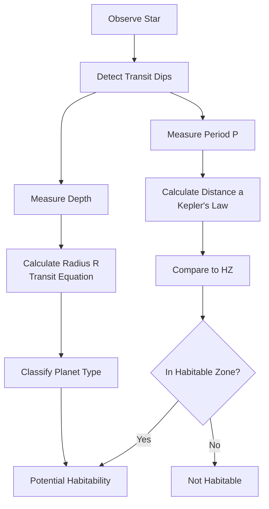

# AST251: Deep Dive Topic Explanations

> Detailed context for each major topic — understand the *why*, not just the *what*

---

## 1. The Search for Life (SETI & The Fermi Paradox)

### The Fundamental Question
**What it is**: The search for extraterrestrial intelligence and the puzzle of cosmic silence

**Key Statistics**:
- ~400 billion stars in the Milky Way
- The Sun is only ~4.6 billion years old
- The galaxy is ~13 billion years old
- At sub-light speeds, a civilization could colonize the entire galaxy in ~10 million years

**Why it matters**: If the conditions for life are common and the galaxy is old, *where is everyone?*

### The Fermi Paradox

**What it is**: The contradiction between the high probability of alien life and the complete lack of evidence for it.

**The Logic**:
1. The galaxy contains hundreds of billions of stars
2. Many are much older than our Sun
3. If even a tiny fraction developed space-faring civilizations...
4. They should have colonized the galaxy by now
5. Yet we see no evidence

**Why it matters**: This paradox shapes how we search for life and what we expect to find.

---

### Fermi Paradox Solutions

#### 1. Rare Earth Hypothesis
**Claim**: Earth is unique. There is no life within contact range.

**The Logic**:
- Evolution from simple life to technological civilization requires an extraordinarily improbable sequence of events
- While planets are common, the specific conditions for complex life are rare
- Things that seem "easy" (multicellularity, intelligence) may be statistical miracles

**Evidence For**: We've found no contact despite searching
**Evidence Against**: Planets are common, building blocks of life are abundant

**Implication**: If true, the "hard step" is behind us — we're the rarity

#### 2. Zoo Hypothesis (Zoo Earth)
**Claim**: Aliens exist and are aware of us, but deliberately quarantine our planet.

**The Logic**:
- Like Star Trek's "Prime Directive" — non-interference with developing species
- Aliens may be scientific observers studying us from afar
- Or they simply find us boring/uninteresting

**Evidence For**: Explains silence without requiring us to be alone
**Evidence Against**: Requires high coordination among all alien civilizations

**Key Feature**: Implies aliens are *benevolent* or *indifferent*

#### 3. Dark Forest Theory
**Claim**: Civilizations exist but stay silent because the universe is dangerous.

**The Logic** (Game Theory):
- You can never know another civilization's true intentions
- A more advanced civilization could destroy you
- The rational choice: destroy others before they can threaten you
- Everyone stays quiet to avoid detection — the galaxy is a "dark forest"

**Evidence For**: Explains why no one is broadcasting
**Evidence Against**: We broadcast radio signals and haven't been destroyed (yet)

**Key Feature**: Implies aliens are *hostile* and *hiding*

> [!danger] Exam Trap
> **Zoo ≠ Dark Forest**
> - Zoo = Benevolent observers, choosing not to interfere
> - Dark Forest = Hostile survivors, hiding from predators

#### 4. Great Filter Hypothesis
**Claim**: Some critical step in the evolution of space-faring life is nearly impossible.

**The Logic**:
- The universe should be teeming with life if all steps were easy
- One step must be the "filter" that blocks almost everyone
- The question: Is it behind us, or ahead of us?

**If Filter is PAST** (we passed it):
- Could be: origin of life, multicellularity, intelligence
- We are special because we made it through
- Connects to Rare Earth hypothesis

**If Filter is FUTURE** (we will hit it):
- Could be: nuclear war, climate collapse, resource exhaustion
- All civilizations destroy themselves before colonizing space
- Ominous implication for humanity

**Why it matters**: Finding simple life would be *bad news* — it would suggest the filter is ahead of us, not behind.

---

## 2. Definitions and Chemistry of Life

### The Problem of Defining Life

**What it is**: The surprisingly difficult task of stating what "life" means

**NASA Working Definition**: "A self-sustained chemical system capable of undergoing Darwinian evolution"

**Why it's problematic**:
- This is a *characteristic list*, not a fundamental theory
- Fire: consumes energy, grows, reproduces — is it alive? No.
- Mule: cannot reproduce — is it not alive? It clearly is.
- Viruses: undergo evolution but can't self-sustain — unclear

**The Deeper Issue**:
- We have the "atomic theory of matter" to define water (H₂O)
- We don't have an equivalent "theory of life"
- We're defining by examples (Earth life), not underlying principles

**"Lyfe" Concept**: Theoretical life that might use different building blocks but share essential properties

**Why it matters**: How we define life determines where and how we search for it

---

### Why Carbon is the Backbone of Life

**What it is**: The chemical basis for all known life

**Carbon's Properties**:
| Property | Why It Matters |
|----------|----------------|
| 4 valence electrons | Can form 4 stable bonds |
| Can form double/triple bonds | Enables chemical variety |
| Creates long chains (polymers) | Enables complex molecules (DNA, proteins) |
| CO₂ is a gas | Easy to exhale and recycle |
| Abundant in universe | Available everywhere |

**Why Not Silicon?**
| Issue | Explanation |
|-------|-------------|
| Weaker bonds | Less stable molecules |
| Limited multiple bonds | Less chemical diversity |
| SiO₂ is a solid (quartz) | "Solid waste problem" — can't exhale rocks |

> [!tip] Key Argument
> When carbon "breathes" (oxidizes), it makes CO₂ (gas) → easily expelled
> When silicon "breathes," it makes SiO₂ (rock) → where would it go?

**Why it matters**: "Life as we know it" is carbon-based because carbon's chemistry is uniquely versatile

---

### Why Water is the Solvent of Life

**What it is**: The medium in which life's chemistry occurs

**Water's Properties**:

| Property | Why It Matters |
|---|---|
| Polar molecule | Dissolves many substances, enables transport |
| Liquid from 273-373K | Wide temperature range for chemistry |
| Ice floats | Insulates oceans from top, life survives below |
| High heat capacity | Stabilizes temperature |

**Why Not Methane (CH₄)?**

| Issue                     | Explanation                             |
| ------------------------- | --------------------------------------- |
| Non-polar                 | Different (weaker) solvent properties   |
| Liquid at very cold temps | Requires Titan-like conditions (<100K)  |
| Solid sinks               | Lakes could freeze solid from bottom up |

> [!important] The "Ice Floats" Advantage
> On Earth: Lake surfaces freeze, but liquid water stays below → life survives winter
> With methane: Solid sinks → entire lake could freeze solid → catastrophic

**"Follow the Water"**: The primary search strategy — where there's liquid water, there may be life

**Why it matters**: Water's unique properties make it an ideal medium for biochemistry

---

### Extremophiles and the Biospace

**What it is**: Organisms that define the limits of life's tolerance

**Examples**:

| Type          | Environment                     | Temperature   |
| ------------- | ------------------------------- | ------------- |
| Thermophiles  | Hot springs, hydrothermal vents | Up to ~120°C  |
| Psychrophiles | Antarctic ice, deep ocean       | Below 0°C     |
| Halophiles    | Salt lakes                      | High salinity |
| Acidophiles   | Acidic environments             | pH < 5        |

**The Biospace**: The theoretical volume of conditions (temperature, pressure, chemistry) where life can survive

**Why it matters**: 
- Expands our definition of "habitable"
- Suggests life could exist in environments we once thought impossible
- Informs target selection for missions (Europa, Enceladus)

---

## 3. Stellar Astrophysics

### Stellar Classification (OBAFGKM)

**What it is**: The spectral classification of stars by surface temperature

**The Sequence** (Hot → Cool):

| Type | Temperature (K) | Color | Relative Size | Luminosity |
|------|-----------------|-------|---------------|------------|
| O | >30,000 | Blue | Largest | Highest |
| B | 10,000-30,000 | Blue-white | | |
| A | 7,500-10,000 | White | | |
| F | 6,000-7,500 | Yellow-white | | |
| G | 5,000-6,000 | Yellow | 1 (Sun=G) | 1 (Sun) |
| K | 3,500-5,000 | Orange | | |
| M | <3,500 | Red | Smallest | Lowest |

> [!danger] Common Misconception
> Students often think "red = hot" (like a stove) and "blue = cold" (like ice)
> **Reality**: Blue is HOTTEST (>30,000K), Red is COOLEST (<3,500K)
> Stars behave as blackbodies — color depends only on temperature

**Why it matters**: Star type determines luminosity, habitable zone distance, and stellar lifespan

---

### The H-R Diagram

**What it is**: A plot of stellar luminosity vs. temperature

**Key Regions**:
```
                    HIGH LUMINOSITY
                         ↑
         [Red Giants]    │    [Blue Giants]
         (cool but huge) │    (hot and huge)
                         │
    ←────────────────────┼────────────────────→
    COOL                 │                  HOT
                         │
                   [Main Sequence]
                   (diagonal band)
                   O→B→A→F→G→K→M
                         │
         [White Dwarfs]  │
         (hot but tiny)  │
                         ↓
                    LOW LUMINOSITY
```

**Main Sequence**: Where stars spend most of their lives fusing hydrogen
- Top-left: Hot, blue, massive, luminous (O, B)
- Bottom-right: Cool, red, small, dim (K, M)
- Sun: Middle (G-type)

**Why it matters**: A star's position reveals its current evolutionary state

---

### Mass, Luminosity, and Lifespan

**The Relationship**:
- High mass → High luminosity → HIGH fuel consumption → SHORT lifespan
- Low mass → Low luminosity → LOW fuel consumption → LONG lifespan

| Star Type | Mass | Lifespan | Why |
|-----------|------|----------|-----|
| O, B (massive) | High | ~10⁷ years | Burn fuel extremely fast |
| G (Sun-like) | Medium | ~10¹⁰ years | Balanced consumption |
| M (red dwarf) | Low | >10¹¹ years | Sip fuel slowly |

> [!warning] Exam Trap
> "Bigger stars have more fuel, so they live longer" is **WRONG**
> They burn fuel so fast that they die young despite having more of it

**Why it matters**: Star lifespan determines how long planets have for life to evolve

---

### M-Dwarf Stars: Promise and Problems

**Why M-dwarfs are interesting**:
1. Most abundant stars in the galaxy
2. Extremely long lifespans (hundreds of billions of years)
3. Nearest star (Proxima Centauri) is an M-dwarf with a planet in the HZ

**The Problems**:

| Issue          | Explanation                                                          |
| -------------- | -------------------------------------------------------------------- |
| Stellar flares | Brightness spikes of 2x or more in minutes → radiation damage        |
| Close HZ       | Planets must orbit very close → intense exposure                     |
| Tidal locking  | Close planets may become tidally locked (one side always faces star) |
| Variability    | Many M-dwarfs have unstable brightness                               |

**The Trade-off**: Long life for potential habitability vs. harsh stellar environment

**Why it matters**: Most planets in the galaxy orbit M-dwarfs — understanding their habitability is crucial

---

### Stellar Evolution and Habitability Over Time

**Key Concept**: Stars change over time, and so does their habitable zone

**The Faint Young Sun Paradox**:
- 4 billion years ago, the Sun was ~70% as bright as today
- Earth should have been frozen solid
- But geological evidence shows liquid water existed
- **Solution**: Early Earth had a stronger greenhouse effect (CO₂, methane atmosphere)

**Rising Luminosity**:
- As the Sun ages, it slowly brightens
- The HZ moves outward over time
- In ~1 billion years: Earth will experience runaway greenhouse
- Water will evaporate, complex life will end

**Red Giant Phase**:
- When hydrogen runs out, Sun leaves main sequence
- Expands dramatically (possibly engulfing Earth)
- Luminosity increases by factor of 10+
- Inner planets sterilized or destroyed

**Why it matters**: Habitability is time-dependent — a planet habitable today may not be tomorrow (or yesterday)

---

## 4. Planetary Habitability

### The Habitable Zone

**What it is**: The region around a star where liquid water can exist on a planet's surface

**Determining Factors**:
1. **Stellar luminosity** — brighter star → farther HZ
2. **Albedo** — higher reflectivity → planet can be closer
3. **Greenhouse effect** — stronger atmosphere → planet can be farther

**Conservative vs. Optimistic HZ**:

| Type         | Definition                                 | Example                                |
| ------------ | ------------------------------------------ | -------------------------------------- |
| Conservative | Strict limits, high confidence             | Based on runaway greenhouse/ice models |
| Optimistic   | Wider limits, includes atmospheric effects | Venus might be included                |

**Why it matters**: The HZ is the primary target zone for exoplanet searches

---

### Equilibrium Temperature

**What it is**: The theoretical temperature of a "naked" planet (no atmosphere)

**The Physics**:
1. Planet receives energy from star (depends on luminosity, distance, albedo)
2. Planet radiates energy back to space (Stefan-Boltzmann law)
3. At equilibrium: Energy in = Energy out

**The Formula**:
$$T_{eq} = \left( \frac{(1-A)L}{16\pi\sigma a^2} \right)^{1/4}$$

**Key Insights**:
- Higher albedo (A) → Lower temperature (more reflection)
- Greater distance (a) → Lower temperature (inverse square law)
- Higher luminosity (L) → Higher temperature

> [!danger] Critical Distinction
> $T_{eq}$ assumes NO atmosphere
> Actual surface temperature is almost always HIGHER due to greenhouse effect
> Example: Earth's $T_{eq}$ ≈ 255K (-18°C), but actual average is ~288K (+15°C)

---

### Albedo and the Greenhouse Effect

**Albedo (A)**:
- Fraction of incoming light reflected (0 to 1)
- High albedo (clouds, ice): More reflection → cooler
- Low albedo (rock, ocean): More absorption → warmer

**Greenhouse Effect**:
- Atmosphere traps outgoing infrared radiation
- Increases surface temperature above $T_{eq}$
- Key gases: CO₂, water vapor, methane

**The Runaway Greenhouse**:
- If too much water evaporates → more greenhouse warming → more evaporation
- Positive feedback loop
- Venus is the classic example — surface temp ~460°C

**Why it matters**: $T_{eq}$ is calculated assuming a "bare rock" planet — the greenhouse effect is what makes Earth habitable

---

## 5. Exoplanet Detection: The Transit Method

### How It Works

**The Mechanism**:
1. A planet orbits a star in our line of sight (edge-on)
2. When the planet passes in front of the star, it blocks some light
3. We observe a temporary "dip" in the star's brightness
4. From this dip, we can determine the planet's size and orbital period

**The Geometry Requirement**:
- Only works if the orbit is aligned nearly edge-on to Earth
- Most planetary systems are NOT aligned this way
- Transit method can only detect a small percentage of existing planets

---

### Reading a Light Curve

**What it shows**: Brightness (flux) vs. time

```
Flux
 ↑
1.0 ───────┐         ┌───────────
           │    ↓    │
           └─────────┘
                ↑
           Transit dip
 ──────────────────────────────→ Time
```

**Key Features**:

| Feature | What It Tells You |
|---------|-------------------|
| Depth of dip | Planet's size (radius) |
| Width of dip | Transit duration |
| Time between dips | Orbital period |
| Shape of dip | Limb darkening effect |
**Ingress**: The downward slope as planet enters transit
**Egress**: The upward slope as planet exits transit

---

### Calculating Planet Properties

**From Transit Depth → Planet Radius**:
$$\text{Depth} = \left( \frac{R_{planet}}{R_{star}} \right)^2$$

$$R_{planet} = R_{star} \times \sqrt{\text{Depth}}$$

**Example**:
- Transit depth = 0.01 (1% dip)
- Star = Sun-like (1 $R_\odot$)
- $R_{planet} = 1 R_\odot \times \sqrt{0.01} = 0.1 R_\odot$
- Jupiter is ~0.1 $R_\odot$, so this is a Jupiter-sized planet

> [!warning] Don't Forget the Square Root!
> Depth is proportional to *area* (squared), so you need square root to get radius

**From Period → Distance (Kepler's Law)**:
1. Measure time between transits → get period (P)
2. Apply $a = \left( \frac{GM_{star} P^2}{4\pi^2} \right)^{1/3}$
3. Compare distance to star's habitable zone

---

### Detection Biases

**What Transits Favor**:

| Bias | Reason |
|------|--------|
| Large planets | Deeper dips, easier to detect above noise |
| Short periods | More frequent transits, faster confirmation |
| Close orbits | Higher probability of edge-on alignment |

**What Transits Miss**:

| Bias          | Reason                           |
| ------------- | -------------------------------- |
| Small planets | Shallow dips lost in noise       |
| Long periods  | May take years to see 3 transits |
| Tilted orbits | Never cross in front of star     |

**Result**: Transit surveys over-represent "Hot Jupiters" (large, close-in gas giants) even though they may not be the most common planet type

---

### Sources of Error and False Positives

**Limb Darkening**:
- Stars are brighter at center, dimmer at edges
- Makes transit dip rounded (not flat-bottomed)
- Can be modeled and corrected for

**Starspots**:
- Dark spots on star surface cause brightness dips
- BUT: They rotate with the star, not perfectly periodic like orbits
- They evolve and change over time

**Eclipsing Binaries**:
- Two stars orbiting each other can mimic transits
- Deeper dips, but can sometimes be confused with planets

**Noise and Gaps**:
- Random fluctuations can hide or fake transits
- Gaps in data can cause "aliasing" (wrong period)

> [!important] Confirmation Requirement
> A single dip is NOT a confirmed planet
> Need at least 3 transits with consistent depth/duration/period

---

### Planet Types

| Type         | Radius         | Description                                         |
| ------------ | -------------- | --------------------------------------------------- |
| Hot Jupiter  | ~1 $R_J$       | Gas giant orbiting very close to star               |
| Super-Earth  | 1-2 $R_\oplus$ | Rocky planet larger than Earth                      |
| Mini-Neptune | 2-4 $R_\oplus$ | Between Earth and Neptune (no solar system analog!) |
| Earth-like   | ~1 $R_\oplus$  | Rocky, potentially habitable                        |
|              |                |                                                     |

> [!tip] Key Insight
> The most common planet type in the galaxy (Super-Earths/Mini-Neptunes) doesn't exist in our solar system!
> Our solar system may not be typical.

---

## 6. Connecting Everything: Finding Habitable Worlds

### The Complete Detection Pipeline



### The Big Picture

1. **Detect**: Find exoplanets using transit method
2. **Characterize**: Determine size, orbit, temperature
3. **Assess**: Is it in the habitable zone?
4. **Investigate**: Look for biosignatures (future work)

**Why this matters**: We're systematically searching for other worlds where life might exist — the first generation to be able to do so.

---

**Last Updated:** February 4, 2026
