# 📚 Topic: Autoencoders – Feed-Forward Neural Networks for Input Prediction

## 🧠 L4: Principles
- **Autoencoder definition**
> - A neural network trained to copy its input to its output.
- **Structure**: 
> - Composed of two parts
- **Encoder**: 
> - Maps input data to a lower-dimensional latent space (compressed representation).
- **Decoder**: 
> - Reconstructs the input from the latent space representation.
- **Learning objective**: 
> - Minimize reconstruction loss (e.g., MSE between input and output).
- **Purpose**: 
> - Learn compact feature representations (unsupervised learning).
- **Applications**: 
> - Dimensionality reduction, anomaly detection, denoising, generative modeling.

---

## 🧩 L3: Models:

```mermaid
mindmap
  root((Autoencoders))
    Principles
      Input ≈ Output
      Encoder → Latent → Decoder
      Unsupervised representation learning
    Models
      Feed-Forward Neural Net
      Undercomplete Autoencoder
      Denoising Autoencoder
      Variational Autoencoder (VAE)
    Operations
      Train with MSE loss
      Use gradient descent
      Extract latent embeddings
    Experience
      Compressing images
      Detecting fraud
      Denoising noisy data
```

---

## ⚙️ L2: Operations
1. **Define network architecture**:
   - Input layer → Hidden layers (Encoder) → Bottleneck (latent code) → Hidden layers (Decoder) → Output layer.
2. **Choose reconstruction loss**:
   - Mean Squared Error (MSE) for continuous inputs.
   - Cross-Entropy for binary inputs.
3. **Train via backpropagation**:
   - Use gradient descent (SGD/Adam).
   - Optimize weights to minimize reconstruction error.
4. **Evaluate**:
   - Compare reconstruction accuracy.
   - Inspect latent representation for structure (clustering, separability).
5. **Extend**:
   - Add noise for **denoising autoencoders**.
   - Impose probabilistic constraints for **variational autoencoders**.

---

## 🌍 L1: Experience
- **Analogy**: Think of autoencoders as a student taking notes.
  - **Encoder** = condenses a lecture into short notes.
  - **Latent space** = the notebook summary.
  - **Decoder** = reconstructs the lecture from notes.
  - The better the notes, the closer the reconstruction is to the original.
- **Real-world examples**:
  - **Image compression**: Shrink a high-resolution image into fewer numbers.
  - **Fraud detection**: Normal transactions are reconstructed well, anomalies are not.
  - **Noise removal**: Clean noisy signals (e.g., blurry images, corrupted audio).

> [!question]  
> Why do autoencoders use both an **encoder** and a **decoder** instead of just one big feed-forward network?

> [!TIP]  
> Use **latent space visualizations** (t-SNE, PCA on embeddings) to explore how autoencoders cluster data internally.

---

## 🔢 Table View: Autoencoder Components

| Component     | Role                              | Example                               |
| ------------- | --------------------------------- | ------------------------------------- |
| Encoder       | Compress input to [[Latent code]] | 784 → 32 neurons (MNIST digit images) |
| Latent code   | Bottleneck representation         | 32-dimensional feature vector         |
| Decoder       | Reconstructs input                | 32 → 784 neurons                      |
| Loss Function | Measures reconstruction error     | MSE or Cross-Entropy                  |
| Training Data | Inputs = Outputs                  | Image → Image, Signal → Signal        |

> [!TIP]  
> Think of autoencoders as **unsupervised feature learners**: instead of labels, the network learns structure directly from the input.