# 📚 Topic: Latent Code in Autoencoders

## 🧠 L4: Principles
- **Latent code** (also called the **bottleneck representation**, **embedding**, or **hidden representation**) is the compressed feature vector produced by the **encoder** part of an autoencoder.  
- It captures the **most salient information** from the input while discarding redundancy/noise.  
- By forcing the network through this lower-dimensional space, the autoencoder learns meaningful structure in the data.  
- Acts as a **learned feature space** for tasks like clustering, visualization, or anomaly detection.

---

## 🧩 L3: Models

```mermaid
mindmap
  root((Latent Code))
    Principles
      Compressed representation
      Encodes key features
      Forces dimensionality reduction
    Models
      Input x → Encoder → h latent
      h has fewer dimensions than x
      Decoder: h → x̂
    Operations
      Extract h for downstream tasks
      Visualize hidden features
      Check reconstruction quality
    Experience
      Like a summary of a book
      Noise ignored, essentials kept
      Fraud detection via reconstruction error
```

---

## ⚙️ L2: Operations
1. **Encoding**:  
   - Input \(x \in \mathbb{R}^d\).  
   - Encoder maps: \( h = f_\theta(x) \), where \( h \in \mathbb{R}^k \) and typically \( k \ll d \).  
2. **Latent usage**:  
   - Feed \(h\) into decoder for reconstruction.  
   - Use \(h\) as compressed features for classification/clustering.  
   - Track \(||x - \hat{x}||^2\) to detect anomalies.  
3. **Design choices**:  
   - Bottleneck size \(k\) controls how much information can be preserved.  
   - Too small → underfitting (loss of critical detail).  
   - Too large → trivial identity mapping (no compression).  

---

## 🌍 L1: Experience
- **Analogy**: Latent code is like a **summary of an entire book on one page**. You lose details but keep the essential storyline.  
- **Case study**:  
   - In MNIST digit autoencoders, inputs are 784 pixels.  
   - Latent code might be 32 dimensions, capturing "loopiness," "slant," or "thickness" of digits.  
   - This makes digits cluster naturally in latent space (e.g., all 3s grouped together).  

> [!question]  
> If you reduce the latent dimension too aggressively, what happens to reconstruction quality?  

---

## 🔢 Table View: Properties of Latent Code

| Property             | Meaning                            | Example                                    |
| -------------------- | ---------------------------------- | ------------------------------------------ |
| ==Dimensionality==   | Size of compressed space           | 784 → 32 (MNIST)                           |
| ==Interpretability== | Encodes abstract features          | Stroke thickness, orientation of digits    |
| ==Reusability==      | Can be used for other tasks        | Feed into logistic regression for digit ID |
| ==Sensitivity==      | Balances compression & accuracy    | Too small → poor reconstructions           |
| ==Visualization==    | Enables clustering & manifold view | 2D latent embeddings for t-SNE/UMAP        |

> [!TIP]  
> Think of latent codes as a **map of the hidden structure** in your data — like GPS coordinates in a compressed space.

