## Note:

# Topic: Bottleneck Layer in Autoencoders

The **bottleneck layer** is a critical component within the architecture of an **autoencoder**, which is a type of feed-forward neural network [L4]. Its fundamental role is to **learn a compressed representation** of the input data [L4].

## 🧠 L4: Principles

An autoencoder's core function is to take an input and predict that same input [L4]. To achieve this while also learning meaningful representations, the network is designed with a **bottleneck layer** [L4]. This layer is intentionally configured to have a **significantly smaller dimension than the input layer** [L4]. This constraint forces the autoencoder to learn an efficient, compressed encoding of the input data, making the reconstruction of the original input a challenging yet informative task.

The bottleneck layer directly contributes to the primary objectives of autoencoders:

- **Dimensionality Reduction**: By compressing high-dimensional input into a lower-dimensional "code" within the bottleneck, autoencoders can reduce data dimensionality. This conserves computation and memory, helps prevent overfitting, and improves the model's ability to generalize.
- **Visualization**: When the bottleneck layer is constrained to two dimensions, it enables the visualization of complex high-dimensional data, revealing underlying structures and clusters.
- **Unsupervised Feature Learning**: The bottleneck layer is where the autoencoder learns abstract features from unlabeled data. These learned features, residing in the compressed representation, can then be used for various supervised learning tasks, which is particularly useful since unlabeled data is often plentiful.

## 🧩 L3: Models

The bottleneck layer is integral to how autoencoders encode an input into a lower-dimensional representation before decoding it back to approximate the original.

### Linear Autoencoders

In a linear autoencoder, which is the simplest form, the bottleneck layer plays a straightforward role:

- It typically has **one hidden layer**.
- The **encoder (`W1`)** maps the high-dimensional input `x` to a lower-dimensional **code `z`** (`z = W1x`). This `z` is the output of the bottleneck layer.
- If the dimension of the bottleneck layer, `K`, is less than the input dimension `D` (`K < D`), the autoencoder performs **dimensionality reduction**.
- A key insight is that for centered data, linear autoencoders **effectively learn the principal components** of the data, as the optimal weights for the encoder (`W1`) become the transpose of the principal components matrix (`U⊤`), and for the decoder (`W2`), they are the principal components matrix itself (`U`). The output of the autoencoder in this case will lie in a K-dimensional subspace spanned by the columns of the decoder matrix `W2`. This PCA subspace is considered the best possible K-dimensional linear subspace for minimal reconstruction error.

```mermaid
graph TD 
X[Input x #D-dim] --> W1[Encoder #W1] 
W1 --> Z[Laten Code z #K-dim -- Bottleneck] 
Z --> W2[Decoder #W2] 
W2 --> X_tilde[Reconstruction x̃ #D-dim]


style W1 fill:#f9f,stroke:#333,stroke-width:2px;
style W2 fill:#f9f,stroke:#333,stroke-width:2px;
style X_tilde fill:#ccf,stroke:#333,stroke-width:2px;
linkStyle 0 stroke:#666,stroke-width:1px;
linkStyle 1 stroke:#666,stroke-width:1px;
linkStyle 2 stroke:#666,stroke-width:1px;
linkStyle 3 stroke:#666,stroke-width:1px;
```

### Nonlinear Autoencoders

For more complex data, **deep nonlinear autoencoders** use non-linear activation functions in their layers, including the bottleneck. This allows them to project data onto a **nonlinear manifold** rather than just a linear subspace. This capability enables them to learn **more powerful codes** for a given dimensionality compared to linear autoencoders (PCA).

## ⚙️ L2: Operations

The bottleneck layer's operation is central to the autoencoder's process:

1. **Forward Pass**: During the forward pass, the D-dimensional input vector `x` is processed by the encoder, which transforms it into a K-dimensional **code `z`** at the bottleneck layer (`z = W1x` for a linear autoencoder) [L2]. This code `z` is the compressed representation that the autoencoder has learned [L2].
2. **Reconstruction**: The decoder then takes this compressed `z` from the bottleneck layer and transforms it back into a D-dimensional **reconstruction `x̃`** [L2].
3. **Optimization**: The network's weights are adjusted to minimize the difference between the original input `x` and its reconstruction `x̃` [L2]. The "learning" occurs as the network optimizes its weights to efficiently represent the input in the reduced dimension of the bottleneck layer and then accurately reconstruct it [L2].

## 🌍 L1: Experience

The bottleneck layer's ability to create a low-dimensional representation has practical benefits:

- **Data Visualization**: By training an autoencoder with a **2-dimensional bottleneck (K=2)**, high-dimensional datasets can be effectively mapped and visualized [L1, 318, 321]. This allows for visual identification of clusters and relationships within complex data, even without explicit labels, such as clustering newsgroup articles by topic [L1, 321].
- **Unsupervised Feature Learning**: The learned compressed representation within the bottleneck layer serves as a set of **meaningful, abstract features** derived from unlabeled data [L1, 318]. These features can then be utilized as inputs for subsequent supervised learning tasks, leveraging the abundance of unlabeled data [L1, 318].

## 🔢 Table View: Autoencoder Types

| Type          | Activation Functions | Goal of Dimensionality Reduction       | Relationship to PCA                               |
| :------------ | :------------------- | :------------------------------------- | :------------------------------------------------ |
| **Linear**    | Linear               | Project data onto a linear subspace    | Learns Principal Components                       |
| **Nonlinear** | Non-linear           | Project data onto a nonlinear manifold | More powerful than PCA for complex data [L3, 320] |
